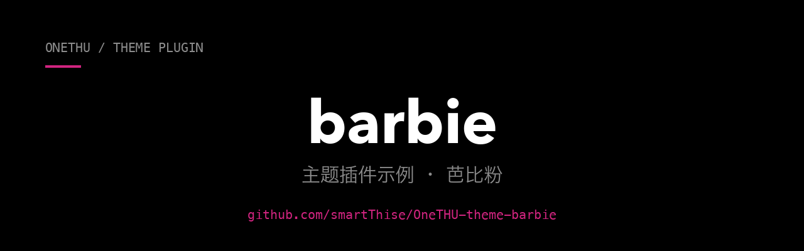

**芭比粉——用最少的代码展示主题插件的完整形态。**

`令牌覆盖 · 品牌标识替换 · 对比度自检`

---

**barbie 是 [OneTHU](https://onethu.github.io/) 的官方主题插件示例。**

[OneTHU](https://github.com/smartThise/OneTHU) 是清华校园套件：统一身份、统一数据层、统一界面，覆盖 macOS / Windows / Android。
本仓库演示主题插件的完整形态（配色令牌、品牌标识、附加 CSS、形状令牌），可直接作为新主题的模板。

## 主题构成

| 部分 | 做法 |
|---|---|
| 配色 | `vars` 覆盖 `tokens.css` 设计令牌：品红强调、粉纸面、深梅字色 |
| 品牌标识 | `logo` 把侧栏 / 顶栏 / 登录页的 OneTHU 字样换成四角星标，`currentColor` 跟随主题 |
| 细节 | `css` 附加作用域规则：侧栏渐变、激活项粉底、主按钮渐变、标签描边 |
| 形状 | 圆角令牌整体放松一档（`--r-sm/md/lg`），观感更软 |

配色不是随手调的：正文、次要字、三级字、链接、按钮白字都按 WCAG 对比度阈值选值
（正文 ≥ 7:1，其余 ≥ 4.5:1），`test.mjs` 会把这些阈值钉成断言。

## 安装与启用

OneTHU → 插件 → 安装面板「GitHub 仓库」输入 `smartThise/OneTHU-theme-barbie`，
或在 [插件市场](https://github.com/smartThise/OneTHU-Market) 搜索「芭比粉」。安装后在 插件页 → 主题 中选中「芭比粉」生效；
设置 → 外观 可把它设为「白天主题」，配合昼夜调度自动切换。

主题插件没有激活函数、不申请任何权限（`permissions: []`），安装即可用。

## 文件

- `plugin.js`：主题本体（`manifest` + `theme`，单文件 ES 模块）
- `test.mjs`：离线自检（令牌名合法性、必覆盖项、CSS 作用域、对比度阈值），`node test.mjs` 直跑
- `package.json`：仅为 `node test.mjs` 的模块解析与 `npm test` 提供，应用不读取
- `docs/banner.png`：本 README 顶部横幅（黑底白字 + 本主题的品红强调色）

## 边界

主题只做令牌覆盖与颜色层面的附加 CSS，不改组件结构、不改布局骨架；附加 CSS 的每条
规则都以 `:root[data-theme="onethu.theme.barbie"]` 限定作用域。

## 相关仓库

| 仓库 | 说明 |
|---|---|
| [OneTHU](https://github.com/smartThise/OneTHU) | 主程序：macOS / Windows / Android 三端与全部文档 |
| [官网 onethu.github.io](https://onethu.github.io/) | 功能总览 · 插件市场（实时）· 设计令牌 · 下载 |
| [OneTHU-Market](https://github.com/smartThise/OneTHU-Market) | 插件市场名单（人工审查收录社区插件） |
| [OneTHU-plugin-hello](https://github.com/smartThise/OneTHU-plugin-hello) | 另一个官方示例：插件能力全景 |
| [OneTHU-Harness](https://github.com/smartThise/OneTHU-Harness) | 内置 Rust 骨干插件：大模型对话助手 |

## 开发文档

- [插件开发指南 §3.4 主题插件](https://github.com/smartThise/OneTHU/blob/dev3/docs/plugin-development.md)：清单规范、主题字段、作用域规约
- [API 参考](https://github.com/smartThise/OneTHU/blob/dev3/docs/api-reference.md)：`ctx.onethu.*` 逐方法说明

## 许可

本示例插件以 **MIT** 许可开源（见 [LICENSE](./LICENSE)），可自由用于任何目的，包括商业用途。

主程序 OneTHU 自身的许可与随包分发的第三方组件另有约定（自有代码 MIT + 两条使用限制；
THU Info App / thu-info-lib 部分受非商业用途授权约束、LearnX 移植部分受其例外条件约束），
见主仓库 [LICENSE](https://github.com/smartThise/OneTHU/blob/dev3/LICENSE) 与
[LICENSES/THIRD-PARTY.md](https://github.com/smartThise/OneTHU/blob/dev3/LICENSES/THIRD-PARTY.md)。
